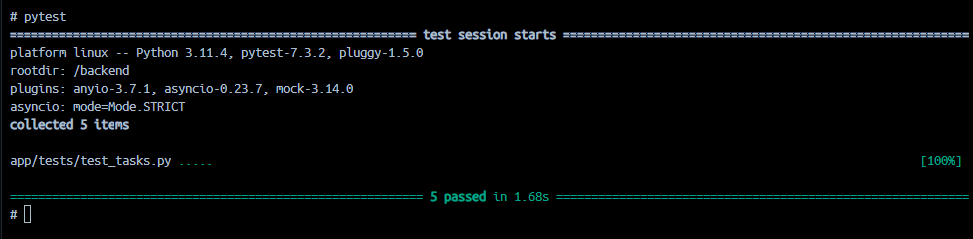

# Тестовое задание для Grass

<br/>
<details>
# Мини Таск менеджер.

### requirements:

- poetry
- fastapi
- uvicorn

## Для проверки корректности работы рекомендую запустить тесты.

## Суть задания:
```
У нас есть 2 маршрута. Создать задачу/прочитать все задачи. 

- Функционал прочитать есть, но работает с ошибкой. (Надо исправить)
- Фунционал создания с валидицией данных нужно дописать. Что будете использовать для валидации
не принципиально.
- Для удобство обернуть в докер.
- Написать как это запустить...
```

## Будет плюсом:
```
- Добавить doc string.
- Добавить функционал для хранения данных в другом хранилище. (SQL, NoSQL и пр..)
- Написать в док к JSONStorage, почему это плохое решение.
```

### Сущность Task:
```
 id: int
 title: string
 completed: bool
 created_at: datetime
 updated_at: datetime
```
</details>

### Как протестировать API локально:
1. Собрать тестовое задание в докере
```python
docker-compose up -d
```
2. Создать файл миграций
```python
backend/scripts/autogenerate_migrations.sh "grass"
```
3. Запустить миграции
```python
backend/scripts/run_migrations.sh
```
4. Запустить pytest
```python
backend/scripts/run_pytest.sh
```
5. Посмотреть, что всё работает 
```python
http://localhost:8000/api/docs
```
PS. Тесты проходят
<br/>